# 🐍 Python Learning Lab
<div align="center">

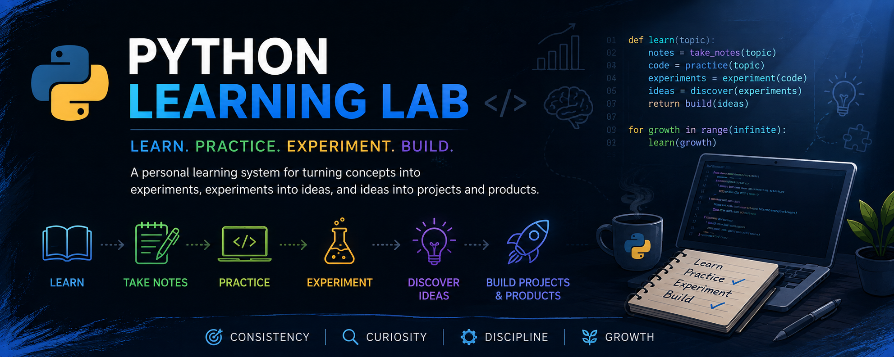

> A personal learning system for transforming knowledge into practical skills, projects, and products.

[](https://www.python.org/)
[](https://jupyter.org/)
[](#)
[](#)

</div>

---

## 🧭 What Is This Repository?

This repository is the foundation behind everything I build with Python.

Rather than treating learning as a collection of tutorials or isolated exercises, I use this repository as a structured environment to study concepts, document knowledge, practice through code, and experiment with ideas.

Every topic I learn is captured here first. Over time, these learning sessions compound into stronger technical skills, project ideas, and real-world applications.

Some of my projects and products originated from concepts that were first explored in this repository.

---

## 🎯 Purpose

The purpose of this repository is to:

* 📚 Learn new concepts systematically
* 📝 Document knowledge through notes
* 💻 Reinforce understanding through coding
* 🔬 Experiment beyond tutorials
* 🧠 Build strong technical foundations
* 🚀 Generate ideas for future projects and products
* 📈 Maintain consistent learning over time

---

## 🔄 The Learning-to-Build Pipeline

Every concept follows the same journey:

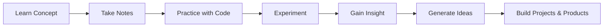

The goal is not merely to understand a concept.

The goal is to apply it, experiment with it, and eventually use it to create something valuable.

---

## 🏗️ Why This Repository Matters

This repository acts as a bridge between learning and building.

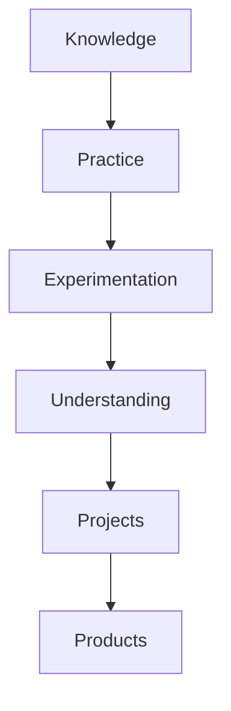

Instead of asking:

> "What did I learn today?"

I try to answer:

> "What can I build from what I learned?"

That mindset turns learning into a long-term asset rather than a short-term activity.

## 🧠 2. Learning System

This repository follows a simple system designed to turn learning into measurable, practical progress.

I don't follow a fixed curriculum or learning schedule. Instead, I decide what to learn based on my current goals, gaps in understanding, and interests, then document the work in the repository.

### 🔄 Learning Cycle

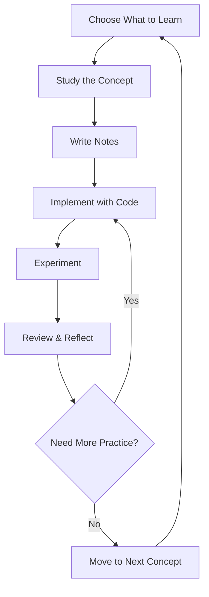

Each cycle combines **understanding and application**. A concept is not considered fully practiced just because I can explain it; I also try to implement and experiment with it.

---

### 📓 What Is a Learning Session?

A **learning session** is a completed unit of focused learning recorded in this repository.

For a session to count, it must produce both:

* 📝 **Notes** — a record of what I learned and understood
* 💻 **Code** — a practical implementation or experiment

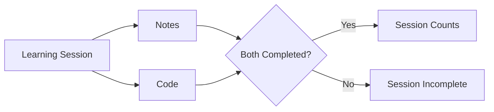

This keeps the measurement focused on **meaningful learning**, rather than simply measuring time spent in front of a screen.

---

### 📅 Adaptive Planning

I do not follow a fixed number of learning sessions every week.

Instead, I set my **planned sessions week by week** based on my available time, priorities, and current workload.

This allows the system to remain consistent without making the schedule rigid.

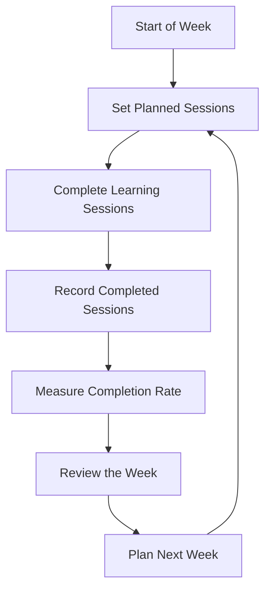

---

### 📈 Lead Measure

The primary measure of this learning system is **Learning Session Completion Rate**.

It measures how consistently I complete the learning sessions I planned.

**Learning Session Completion Rate**

> **Completed Learning Sessions ÷ Planned Learning Sessions × 100**

For example:

> 4 completed sessions ÷ 5 planned sessions × 100 = **80% completion**

The purpose of this measure is not to maximize the number of sessions.

It is to build a habit of **planning intentionally and following through consistently**.

---

### 🎯 What I Measure vs. What I Build

The things I eventually build are outcomes of the system. They are not the primary measure of whether the system is working.

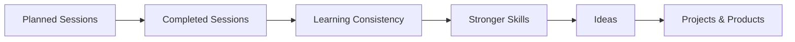

**Lead measure:** Learning Session Completion Rate

**Long-term outcomes:** Stronger skills, better understanding, project ideas, projects, and products.

## 🚀 3. From Learning to Building

The purpose of practicing concepts is not to keep them isolated inside notebooks.

As I learn and experiment, I look for opportunities to apply that knowledge to larger problems. Some of my projects and products have directly originated from ideas, concepts, or experiments explored in this repository.

### 🔗 The Connection

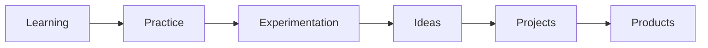

This creates a continuous feedback loop:

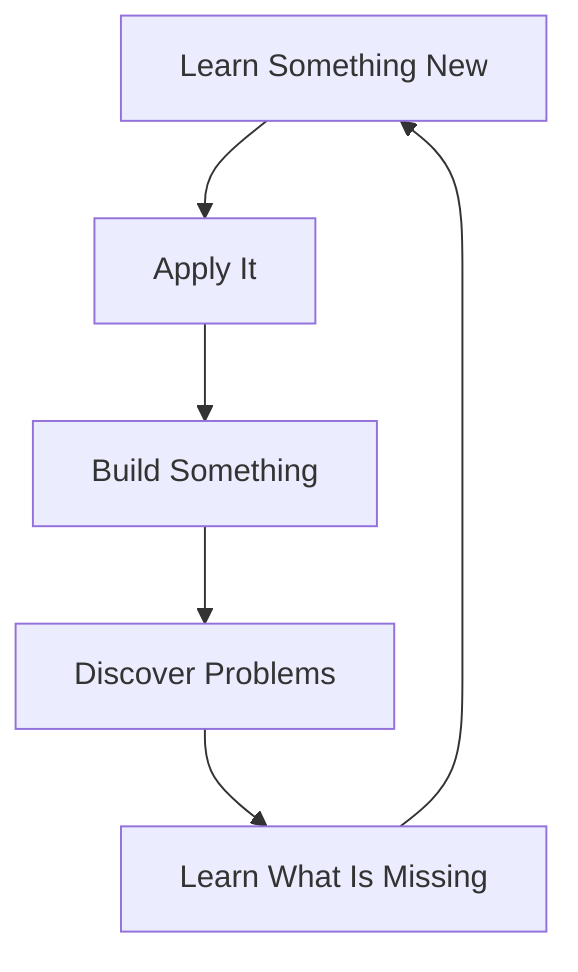

Building projects also exposes gaps in my knowledge, which gives me new topics to study and practice in this repository.

---

### 🏗️ Projects Built From This Foundation

| Learning Area                  | What I Practiced                                   | What It Led To                      |
| ------------------------------ | -------------------------------------------------- | ----------------------------------- |
| 📦 Object-Oriented Programming | Classes, objects, composition, system design       | [CLI E-Commerce Backend](#)         |
| 📊 Data Analysis               | Pandas, data cleaning, transformation, EDA         | [Superstore Sales Analysis](#)      |
| 🤖 Generative AI               | AI workflows, knowledge organization, RAG concepts | [Knowledge Publishing Assistant](#) |

These projects are not separate from the learning process.

They are **extensions of it**.

---

### 🧩 Example: OOP → E-Commerce Backend

My OOP practice introduced concepts such as classes, object relationships, composition, and system design.

I then applied those concepts to build a CLI-based e-commerce backend.

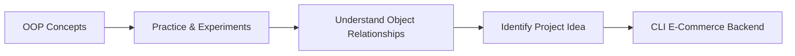

---

### 📊 Example: Data Analysis → Superstore Sales Analysis

I first practiced data analysis concepts in this repository, including data cleaning, transformation, aggregation, and exploratory analysis.

Those skills were then applied to a larger dataset and developed into the **Superstore Sales Analysis** project.

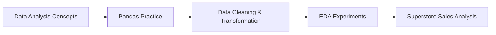

---

### 🤖 Example: Learning → Product Idea

The same principle applies beyond traditional programming projects.

Experiments with AI, knowledge organization, and content generation eventually led to the idea for a **Knowledge Publishing Assistant**.

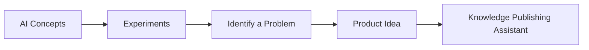

---

### 🌱 The Repository as a Project Incubator

Over time, this repository becomes more than a record of what I have learned.

It becomes a **source of ideas**.

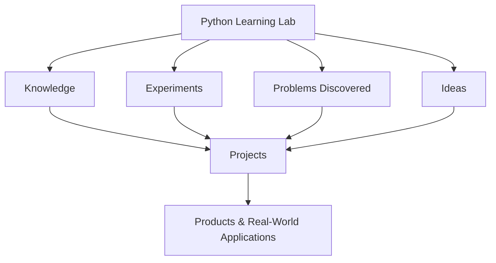

The projects I build are therefore not the end of the learning process.

They are evidence that the learning process is producing something useful.

## 📂 4. Repository

This repository grows incrementally as I learn new concepts, explore new technologies, and strengthen existing skills.

The structure is organized primarily around **learning areas**, with each area containing the notes, implementations, and experiments associated with that subject.

### 🗂️ Repository Structure

```text
python-learning-lab/
│
├── core_python/
│   ├── 01_conditionals.ipynb
│   └── ...
│
├── OOP/
│   ├── 01_oop_basics.ipynb
│   └── ...
│
├── data_analysis/
│   ├── 01_numpy.ipynb
│   ├── 02_pandas.ipynb
│   ├── 03_data_cleaning.ipynb
│   └── ...
│
├── machine_learning/
│   └── 01_classification.ipynb
|   └── ...
│
├── assets/
|   └── ...
|
├── requirements.txt
├── .gitattributes
└── README.md
```

The exact structure will evolve as new learning areas are added.

---

### 📚 Learning Areas

#### 🐍 Core Python

Fundamental and advanced Python concepts used to build strong programming foundations.

* Variables
* Conditionals
* Loops
* Functions and Recursion
* Procedural Programming
* Algorithms
* Data Structures
* Comprehensions
* Functional Programming
* File Handling
* Exception Handling
* Iterators and Generators
* Modules and Packages
* Testing and Debugging

#### 📦 Object-Oriented Programming

Understanding how to design and model software using objects.

* Classes and Objects
* Encapsulation
* Abstraction
* Decorators
* Getters and Setters
* Inheritance
* Polymorphism
* Aggregation and Composition
* Object Relationships
* Real-World System Design

#### 📊 Data Analysis

Developing the skills required to transform raw data into useful insights.

* NumPy
* Pandas
* Data Cleaning
* Data Transformation
* Data Analysis
* Exploratory Data Analysis
* Data Visualization

#### 🤖 Machine Learning

Building the foundation required to understand and develop machine learning systems.

* Scikit-Learn
* Data Preprocessing
* Supervised ML
* Classification
* Regression
* Model Training
* Model Evaluation
* Unsupervised ML
* Clustering
* Dimensionality Reduction
* Machine Learning Experiments

#### 🧠 Artificial Intelligence

An evolving area focused on understanding and applying modern AI technologies.

* Generative AI
* AI Applications
* Retrieval-Augmented Generation
* AI-Assisted Development
* AI Product Experiments

#### 🔮 Future Areas

The repository will continue to expand as my learning progresses.

Potential areas include:

* Deep Learning
* Neural Networks
* Computer Vision
* Natural Language Processing
* MLOps
* Advanced AI Applications

---

### 📓 What Each Learning Area Contains

Learning areas generally contain a combination of:

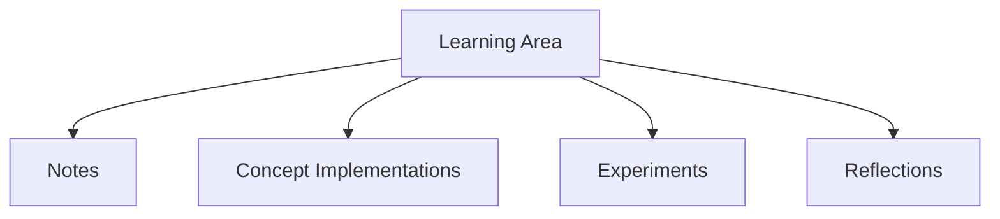

The exact contents depend on the subject and the purpose of the session.

The emphasis is on **understanding and experimentation**, not producing perfectly polished code.

---

### 🔄 Continuous Evolution

This repository is intentionally unfinished.

New concepts, experiments, corrections, and learning areas will continue to be added over time.

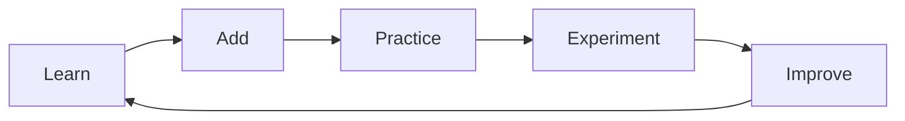

Older notes may be revised as my understanding improves, and experiments may remain imperfect or incomplete.

That is intentional.

The repository represents an **evolving learning system**, not a finished course or polished software product.

---
## 🚀 Getting Started

You can explore the repository locally by cloning it:

```bash
git clone https://github.com/saad-sufyan-dev/python-practice.git
cd python-practice
```

Open the repository in your preferred editor or Jupyter environment and explore any learning area that interests you.

Most practice work is contained in Jupyter Notebooks (`.ipynb`), so having **Jupyter Notebook, JupyterLab, or VS Code** with the appropriate Python environment is recommended.

> This repository is primarily a learning resource, so there is no single application to install or run.

---

## 📦 Requirements

This project uses the following Python libraries:

```text
pandas
numpy
matplotlib
seaborn
jupyter
scikit-learn==1.3.2
imbalanced-learn==0.11.0
...
```

Install them through pip command:

```bash
pip install -r requirements.txt
```

## 🤝 Contributing

Although this is a personal learning repository, ideas and constructive contributions are welcome.

If you notice:

* An incorrect explanation
* A technical mistake
* A better approach
* A useful resource
* An interesting concept worth exploring

feel free to open an **Issue** or submit a **Pull Request**.

Thoughtful feedback can help improve both the repository and my understanding.

---

## ⭐ Support the Journey

If you find this repository useful, interesting, or helpful for your own learning, consider giving it a **star** ⭐ on GitHub.

It helps others discover the repository and motivates me to keep learning, experimenting, and building.

---

## 👤 About Me

Hi, I'm **Saad Sufyan**, a student and aspiring data professional interested in **Python, Data Analysis, Machine Learning, and Artificial Intelligence**.

I use this repository as my personal learning foundation—studying concepts, documenting what I learn, experimenting with code, and turning useful ideas into projects and products.

My goal is simple:

> **Learn continuously, build deliberately, and turn knowledge into something useful.**

You can find more of my work on GitHub:

**GitHub:** [saad-sufyan-dev](https://github.com/saad-sufyan-dev)

---

## 📌 A Note About This Repository

This repository is intentionally a work in progress.

You may encounter:

* Incomplete experiments
* Rough implementations
* Mistakes and corrections
* Evolving notes
* Multiple approaches to the same problem

These are not separate from the learning process—they are **evidence of it**.

The repository will continue to evolve as I learn, experiment, and build.
